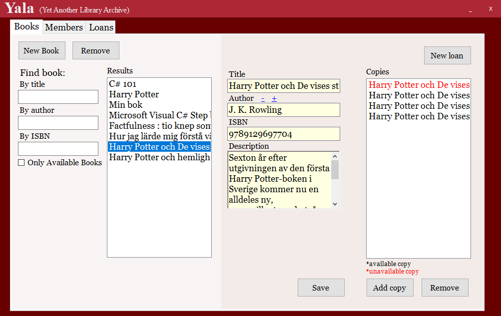
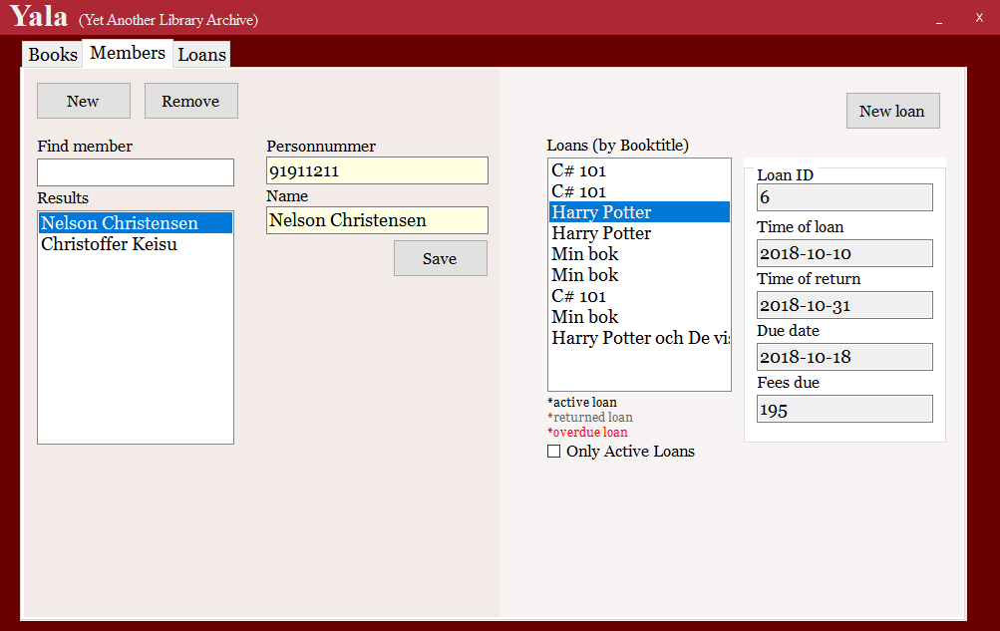
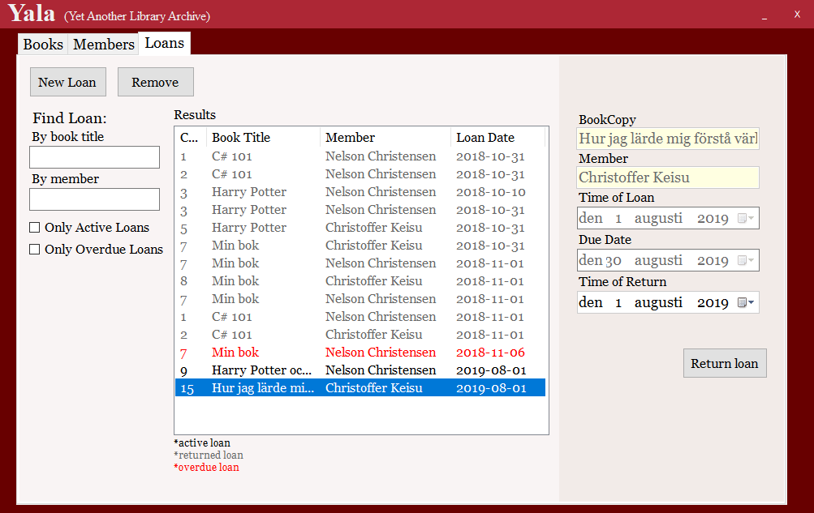

# Yala (Yet Another Library Archive)

Yala was a school assignment that a classmate and I did together. I had a programming lead on the project, whereas my classmate had more of a designer and backup coding role.
The application was built using .NET and C#, and the GUI was built using Windows.Forms.
The data storage is a client-side database that is accessed using LINQ-to-Entities and Entity Framework.

The system allows the user to add books, search for books, add copies of that book, add members and loan out a copy to a member.

# Features:  
•Autocomplete author, to prevent user from adding a new author when the same author already exists in the database.  
•Add multiple authors for a book.  
•Search for available books only (with copies available).  
•Add new member.  
•Search for members based on name.  
•View all loans for selected member.  
•View all overdue loans.  
•Calculate fees for late returns based on days late.  
•Add new loans (where you select due date).  
•Return loan.  

# Preview
Book Page

Member Page

Loan Page

